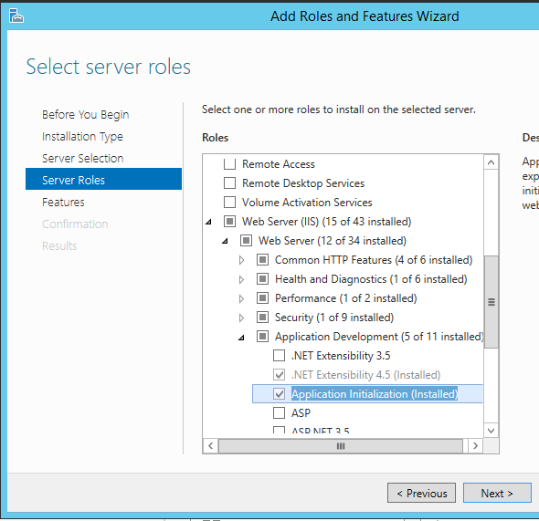
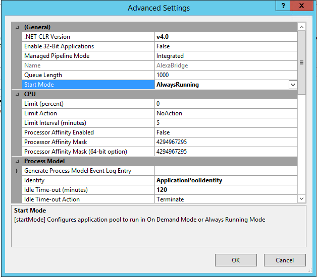
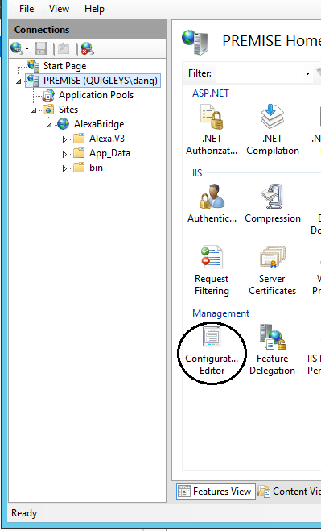
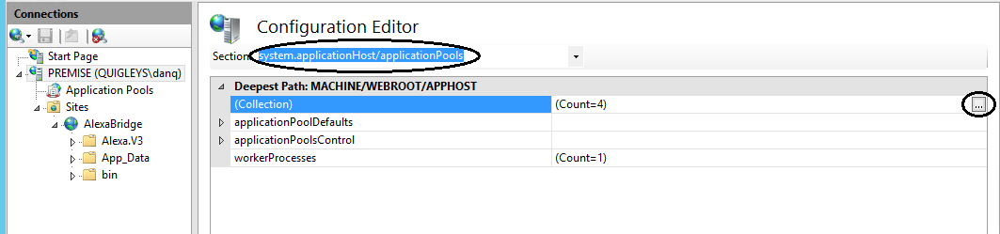
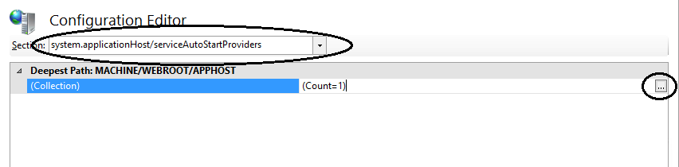
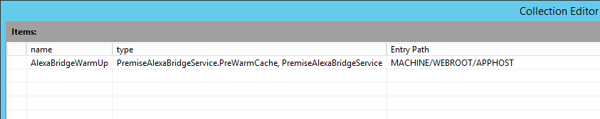
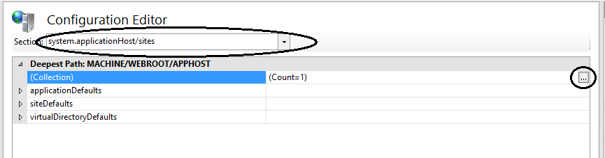
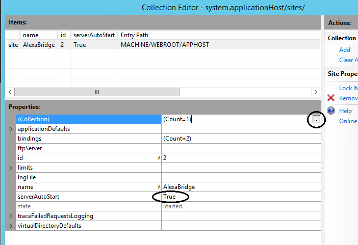
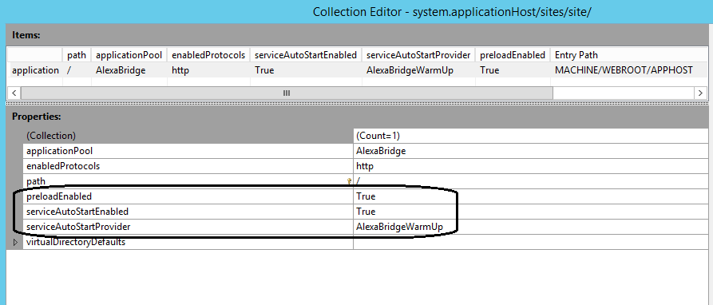

# Installation Instructions
## Initial IIS Setup and Configuration

TODO

## Step X. Configure IIS Pre-Load for Premise Discovery and Subscription Cache 
With the addition of Proactive State Updates (PSUs), the Premise web service must subscribe to asynchronous property changes on home-level objects that are sent to Alexa during discovery. These subscriptions notify the web service which in turn, sends a StateChange event to Alexa. To accomplish this, the web service must maintain a subscription cache and maintain a live connection to the premise server. This process occurs when the premise web service responds to Discovery directives. However, in larger systems, the time it takes to iterate the premise DOM and setup hundreds of subscriptions can exceed the time that the Alexa service waits for a response. 

IIS has an **Application Initialization** feature that is used to pre-load the the discovery and subscription cache. Please follow these instructions to correctly configure that feature on IIS. 

### Step X.1 Install the IIS Application Initialization Feature

The Application Initialization feature is found within the IIS "Application Development" sub-feature needs to be installed. From the Server Manager:
1. Select Manage
1. Select Add Roles and Features 
   *Note: If you have a server group you may need to **Select Server Selection** then **Select the desired server**.* 
1. Select Server Roles
1. Expand Web Server (IIS)
1. Expand Web Server
1. Expand Application Development
1. Select Application Initialization
1. Restart the server to effect above changes

### Step X.2 Enable _Always Running_ on the Application Pool

1. In Internet Information Services (IIS) Manager
1. Locate and Select the Correct Application Pool
1. Right Click and Select **Advanced Settings...**
1. Change the **Start Mode** value to **Always Running**
1. Set the **Idle Time-out (Minutes)** value to **120**
1. Click Ok

### Step X.3 Open the IIS Web Server Configuration Editor
Go to Main Application IIS Root select **Configuration Editor**. This changes the IIS applicationhost.config file. Changing that file is much safer through the configuration editor than doing it manually.

### Step X.4 Edit system.applicationHost/applicationPools

1. Select **system.applicationHost/applicationPools** from the drop-down in the upper left corner of the Configuration Editor window.
1. Click on the elipsis *(...)* for the **(Collection)** property.
1. Select the correct **Application Pool**.
1. Make sure the **autoStart** property is set to **True**.
1. Double-check *(not shown)* that the **startMode** mode=**AlwaysRunning**.
1. Close the window.

### Step X.5 Edit system.applicationHost/ServiceAutoStartProviders

1. Select **system.applicationHost/ServiceAutoStartProviders** from the drop-down in the upper left corner of the Configuration Editor window.
1. Click on the elipses *(...)* for the **(Collection)** property.
1. Click **Add** under the **Collection** in the **Actions:** browser on the right side of the window.
1. Type **AlexaBridgeWarmUp** for the name.
1. Type **PremiseAlexaBridgeService.PreWarmCache, PremiseAlexaBridgeService** for the type.
1. Close the window

### Step X.6 Edit system.applicationHost/Sites

1. Select **system.applicationhost/Sites** from the drop-down in the upper left corner of the Configuration Editor window.
1. Click on the elipses *(...)* for the **(Collection)** property.
1. Select the correct site.
1. Ensure the **serverAutoStart** property is True.
1. In the Properties window, click on the elipses *(...)* for the **(Collection**) property.
1. Ensure **preLoadEnabled** is set to True
1. Ensure **serviceAutoStartEnabled** is set to True
1. Ensure **serviceAutoStartProvider** is set to **AlexaBridgeWarmUp**
1. Close the windows and **Apply** changes.

### Final Steps
1. Stop IIS
1. Kill the w3wp.exe service
1. Publish the new code
1. Ensure the application pool is running
1. Start IIS

If you monitor the w3wp.exe service in Task Manager you should see the warm-up behavior.

